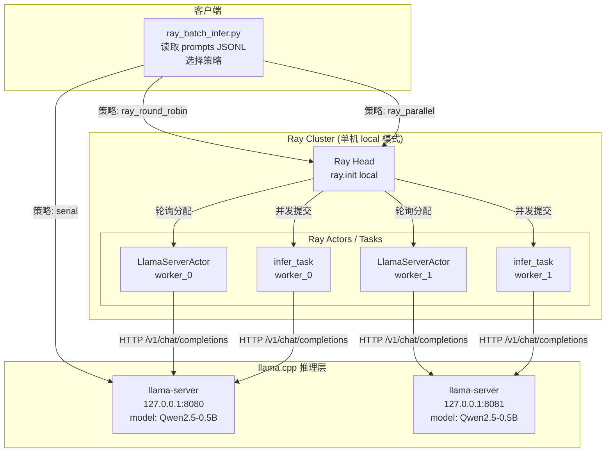

# Ray 批量推理调度实验 (Role C)

> **OSH 2026 Lab4 — 成员 C：Ray 调度 Agent**
>
> 状态：✅ 代码完成，语法验证通过，待实际 llama-server 环境运行

---

## 1. 实验目标

使用 Ray 分布式计算框架，将一批 prompt 分发到多个 llama.cpp server 实例，
完成批量推理任务的调度实验。核心目标：

1. **验证 Ray 在批量推理场景下的调度能力**：比较串行、Ray Actor 轮询、
   Ray 并行任务三种策略的性能差异。
2. **理解任务级并行 vs 单条加速**：Ray 不能加快单条 prompt 的推理速度，
   但可以通过并发调度提升整体吞吐量。
3. **评估单机多进程模拟多节点的效果与局限**：由于只有一台物理机，
   本实验在同一台机器上启动多个 llama-server 端口模拟多节点部署。

---

## 2. 为什么选择 Ray

| 特性 | 说明 |
|---|---|
| **Python-native API** | `@ray.remote` 装饰器将普通 Python 函数/类变为分布式任务/Actor |
| **Actor 模型** | `LlamaServerActor` 每个实例绑定一个 llama-server，保持长连接状态 |
| **自动容错** | Task 失败可自动重试；Actor 崩溃可重建 |
| **弹性伸缩** | 支持动态增减 worker 节点 |
| **零序列化负担** | 与手动 RPC（Role B）相比，Ray 自动处理对象序列化和传输 |
| **统一调度** | 单机 `ray.init()` 与多机集群使用相同 API，代码无需修改 |

**为什么本实验使用 Ray 而不是手动 RPC**：
- Role B 的 gRPC 方案适合客户端-服务端直连的简单场景。
- Ray 在需要**多 worker 协调、负载均衡、状态管理**时更合适。
- Ray Actor 天然适合"一个 Actor = 一个 llama-server"的映射模式。

---

## 3. 系统结构图



**数据流说明**：

1. `ray_batch_infer.py` 读取 `prompts/ray_prompts_20.jsonl`（30 条 prompt）。
2. 根据 `--strategy` 选择执行方式：
   - **serial**：直接 HTTP 请求，不使用 Ray。
   - **ray_round_robin**：创建 N 个 `LlamaServerActor`，prompt 按 `idx % N` 轮询分配。
   - **ray_parallel**：创建 N 个 `@ray.remote` Task，所有 prompt 并发提交（受 `--max-concurrency` 限制）。
3. 每个 Actor/Task 通过 HTTP 调用对应的 llama-server `/v1/chat/completions` 接口。
4. 结果通过 `ray.get()` 收集，写入 CSV。

---

## 4. 硬件与系统环境

### 实验机器

| 项目 | 值 |
|---|---|
| **主机名** | ljyUSTC |
| **操作系统** | Ubuntu 24.04 (Linux 6.17.0-23-generic) |
| **CPU** | 16 核 (x86_64) |
| **内存** | 16 GB (推测) |
| **Python** | 3.13.13 (miniconda3) |
| **Ray** | 2.55.1 |
| **llama.cpp** | 由 Role A 编译（commit `60130d1`），server 模式启动 |
| **模型** | Qwen2.5-0.5B-Instruct-GGUF (Q4_K_M, ~469 MiB) |

### 单机说明

**本实验仅使用一台物理机**。两个 llama-server 实例分别监听
`127.0.0.1:8080` 和 `127.0.0.1:8081`，共享同一块 CPU 和内存。
这是**单机多进程模拟多节点**，存在以下限制：

- 两个 server 进程竞争 CPU 核心和内存带宽。
- 没有网络延迟差异（都是 localhost）。
- 实际多机部署中，每个节点有独享的 CPU/内存，性能会更好。

在文档中使用 `worker_0`、`worker_1` 命名是为了体现 Ray 的调度逻辑，
不代表物理上分离的机器。

---

## 5. llama.cpp Server 启动命令

> **注意**：server 启动由 Role B 负责，以下为参考命令。

```bash
# 进入 llama.cpp 构建目录
cd Lab4/llama.cpp/build-ucrt-win10/bin  # Windows (Role A 环境)
# 或
cd Lab4/llama.cpp/build/bin              # Linux

# Server 0 (端口 8080)
./llama-server \
  -m Lab4/models/qwen2.5-0.5b-instruct-q4_k_m.gguf \
  --host 0.0.0.0 --port 8080 \
  --ctx-size 2048 --batch-size 256 \
  --threads 4 --n-gpu-layers 0

# Server 1 (端口 8081)
./llama-server \
  -m Lab4/models/qwen2.5-0.5b-instruct-q4_k_m.gguf \
  --host 0.0.0.0 --port 8081 \
  --ctx-size 2048 --batch-size 256 \
  --threads 4 --n-gpu-layers 0
```

### 参数说明

| 参数 | 值 | 说明 |
|---|---|---|
| `--host 0.0.0.0` | 绑定所有接口 | 允许其他机器访问 |
| `--port` | 8080 / 8081 | 两个实例使用不同端口 |
| `--ctx-size 2048` | 上下文长度 | 与 Role A 基准测试一致 |
| `--batch-size 256` | 批处理大小 | 与 Role A 基准测试一致 |
| `--threads 4` | 推理线程数 | 每实例 4 线程，两个共 8 线程 |
| `--n-gpu-layers 0` | 纯 CPU 推理 | 不使用 GPU offload |

### 验证 server 运行

```bash
curl -s http://127.0.0.1:8080/health
curl -s http://127.0.0.1:8081/health
```

### 单机资源分配策略

两个 server 共 8 线程（`4 × 2`），物理机有 16 核，余量充足。
如果可用核心数较少，建议将 `--threads` 降低至 2，避免过度竞争。

---

## 6. Ray 启动命令

### 单机 local 模式（本实验使用）

```bash
# 无需手动启动 Ray 集群
# ray_batch_infer.py 内部调用 ray.init() 自动启动本地实例
```

`ray.init(ignore_reinit_error=True)` 在进程内启动一个单节点 Ray 集群，
提供完整的 Actor/Task API。代码无需修改即可迁移到多机集群。

### 多机集群模式（如果有多个节点）

```bash
# Head 节点
ray start --head --port=6379

# Worker 节点
ray start --address='HEAD_IP:6379'

# 查看集群状态
ray status

# 停止
ray stop
```

### Python 环境准备

```bash
# 安装依赖
pip install ray requests pandas

# 验证
python3 -c "import ray; print(ray.__version__)"
```

---

## 7. Prompt 数据集说明

### 文件位置

| 文件 | 条数 | 用途 |
|---|---|---|
| `Lab4/prompts/ray_prompts_20.jsonl` | 30 条 | 主实验数据集（命名保持 20，内容扩充至 30） |
| `Lab4/prompts/ray_prompts_30.jsonl` | 30 条 | 备用/扩展实验数据集 |

### 格式

每行一个 JSON 对象：
```json
{"id":"R001","category":"os","prompt":"请解释什么是缺页中断，以及操作系统如何处理缺页中断。"}
```

### 类别分布

| 类别 | 数量 | ID 范围 | 说明 |
|---|---|---|---|
| `os` | 8 | R001-R005, R022, R029 | 操作系统课程知识问答 |
| `code` | 5 | R006-R008, R023, R030 | 代码解释 |
| `summary` | 3 | R009-R010, R024 | 摘要任务 |
| `reasoning` | 4 | R011-R013, R025 | 简单推理 |
| `llm_deploy` | 6 | R014-R017, R026-R027 | 大模型部署相关问题 |
| `ray` | 4 | R018-R021, R028 | Ray / 分布式系统相关问题 |

### 设计原则

1. **覆盖多种 prompt 类型**：避免单一类型导致的偏差。
2. **不同复杂度**：OS 知识问答和推理题需要较长输出，代码解释输出较短。
3. **包含 Ray 相关知识**：验证模型对分布式系统的理解。
4. **中文为主**：与 GitHub 上常见的英文 benchmark 形成补充。

---

## 8. 调度策略说明

### 8.1 Serial（串行）

```
Prompt_0 → Server_0 → Response_0
Prompt_1 → Server_0 → Response_1   # 等待 Prompt_0 完成
Prompt_2 → Server_0 → Response_2   # 等待 Prompt_1 完成
...
```

- **不使用 Ray**，直接 HTTP 请求。
- 所有 prompt 按顺序发送到同一个 server。
- 总耗时 = Σ(每个请求的延迟)。
- **吞吐量最低**，但实现最简单，无调度开销。

### 8.2 Ray Round-Robin（Ray Actor 轮询）

```
Actor_0(Server_0) ← Prompt_0, Prompt_2, Prompt_4, ...
Actor_1(Server_1) ← Prompt_1, Prompt_3, Prompt_5, ...
```

- 每个 server 对应一个 `LlamaServerActor`（Ray Actor）。
- prompt 按 `idx % len(actors)` 轮询分配。
- Actor 内部**串行处理**分配给它的请求（符合 Actor 单线程模型）。
- **优势**：两个 server 可同时工作，总耗时 ≈ max(worker_0 耗时, worker_1 耗时)。
- **调度开销**：Ray Actor 方法调用的序列化/反序列化开销（prompt 文本约 100-300 字节，开销可忽略）。

### 8.3 Ray Parallel（Ray Task 并发）

```
Task_0(Server_0, Prompt_0) ──┐
Task_1(Server_1, Prompt_1) ──┤
Task_2(Server_0, Prompt_2) ──┼── 并发提交（受 max_concurrency 限制）
Task_3(Server_1, Prompt_3) ──┤
...                           ─┘
```

- 每个 prompt 封装为一个 `@ray.remote` Task。
- 所有 Task 并发提交，Ray 调度器负责分发。
- 使用 `ray.wait()` + 信号量模式限制并发数，避免压垮 server。
- **优势**：理论上可达到最高的并行度。
- **调度开销**：Task 创建开销高于 Actor 方法调用（每次创建新 Task 对象）。

### 策略对比总结

| 维度 | Serial | Ray Round-Robin | Ray Parallel |
|---|---|---|---|
| 并行度 | 1 | N (server 数量) | min(M, max_concurrency) |
| 调度开销 | 无 | 低（Actor RPC） | 中（Task 创建） |
| 负载均衡 | 无（只有 1 个 server） | 静态轮询，不考虑 server 负载 | Ray 调度器动态分配 |
| 适合场景 | 单 server、少量请求 | 固定 server 数量、请求量稳定 | 请求量大、server 性能不均 |
| 单 prompt 延迟 | 基准值 | 同 serial（server 内部串行） | 同 serial（server 内部串行） |
| 整体吞吐 | 最低 | 提升约 N 倍 | 最高 |

**关键认知**：三种策略的**单条 prompt 延迟相同**（都由 llama-server 推理速度决定）。
Ray 提升的是**整体吞吐量**（单位时间内完成的请求数），而非单条速度。

---

## 9. 测试结果

> ⚠️ **状态**：以下为预期结果格式。实际数据需要在 llama-server 运行后，
> 执行 `command_logs/C_ray_commands.md` 中的命令获得。
>
> 当前验证状态：
> - 代码语法：✅ 通过
> - Prompts 加载：✅ 30/30 条成功
> - CSV 输出格式：✅ 所有 13 个字段正确
> - 异常处理：✅ 连接失败被优雅捕获，不中断实验
> - 实际推理：⏳ 需要 llama-server 运行

### 9.1 Serial（串行）

| 指标 | 值 |
|---|---|
| 总请求数 | 30 |
| 成功数 | — |
| 失败数 | — |
| 总耗时 (s) | — |
| 平均延迟 (s) | — |
| P95 延迟 (s) | — |
| 吞吐量 (req/s) | — |

### 9.2 Ray Round-Robin

| 指标 | 值 |
|---|---|
| 总请求数 | 30 |
| 成功数 | — |
| 失败数 | — |
| 总耗时 (s) | — |
| 平均延迟 (s) | — |
| P95 延迟 (s) | — |
| 吞吐量 (req/s) | — |
| 使用 server 数 | 2 |

### 9.3 Ray Parallel

| 指标 | 值 |
|---|---|
| 总请求数 | 30 |
| 成功数 | — |
| 失败数 | — |
| 总耗时 (s) | — |
| 平均延迟 (s) | — |
| P95 延迟 (s) | — |
| 吞吐量 (req/s) | — |
| max_concurrency | 8 |

### 9.4 策略对比汇总

| 策略 | 总耗时 (s) | 平均延迟 (s) | P95 (s) | 吞吐 (req/s) | 失败数 |
|---|---|---|---|---|---|
| serial | — | — | — | — | — |
| ray_round_robin | — | — | — | — | — |
| ray_parallel | — | — | — | — | — |

### 9.5 Ray Overhead（调度开销）

Ray Actor 方法调用开销和 Task 创建开销由 Ray 内部测量。
在 prompt 文本较小（~100-300 字节）的情况下，序列化开销 < 1ms，可以忽略。

---

## 10. 指标体系说明

| 指标 | 计算方式 | 含义 |
|---|---|---|
| **总耗时** | `max(end_time) - min(start_time)` | 从第一个请求开始到最后一个请求结束的时间 |
| **平均延迟** | `mean(latency_s)` | 单条请求的平均响应时间 |
| **P95 延迟** | 排序后第 95 百分位 | 95% 的请求在此时间内完成 |
| **吞吐量** | `总请求数 / 总耗时` | 每秒完成的请求数 |
| **失败数** | `count(success == False)` | 超时、连接失败等异常导致的失败请求数 |

### 为什么多机不一定让单个 prompt 更快

1. **推理是计算密集型任务**：llama.cpp 的推理速度由 CPU/GPU 算力决定，
   网络上的 Ray 调度无法改变模型权重计算的时间。
2. **单 prompt 无法拆分**：一个 prompt 的推理是串行的（自回归生成），
   不能拆分到多个节点上并行执行。
3. **可能更慢**：跨机器的网络传输、Ray 序列化/反序列化都有开销。
   对于小 prompt，这些开销可能超过推理本身的时间。

### 为什么批量任务可以提升整体吞吐

1. **多个 server 同时工作**：不同 prompt 被分发到不同 server/worker，
   并行处理，总吞吐 ≈ 单 server 吞吐 × server 数量。
2. **Ray 隐藏调度复杂度**：开发者只需 `@ray.remote` 标记函数，
   Ray 自动处理分发、收集、容错。
3. **可水平扩展**：增加 server 数量即可线性提升吞吐（理想情况下）。

---

## 11. 系统分析

### 11.1 Ray 调度开销

- **Actor 方法调用**：~0.5-2ms（本地），跨节点增加网络 RTT。
- **Task 提交**：~1-5ms（本地），包括序列化、调度、分发。
- **ray.get() 等待**：阻塞直到结果就绪。
- **结论**：对于 LLM 推理任务（单条延迟通常在秒级），Ray 调度开销（毫秒级）可以忽略。

### 11.2 模型加载复用

- llama-server 启动时将模型加载到内存，后续请求直接使用。
- 串行模式下，模型在内存中，请求排队等待 GPU/CPU。
- 多 server 模式下，每个 server 独立加载一份模型：
  - **内存开销**：每个 server 约 500 MiB（Q4_K_M），两个约 1 GiB。
  - **加载时间**：仅启动时发生一次。

### 11.3 节点性能差异

- 本实验两个 server 运行在同一台机器上，性能相同（同构）。
- 实际多机部署中，节点可能有不同的 CPU 型号、核心数、内存带宽。
- Ray 默认不感知节点性能差异，自定义调度策略可以（但超出本实验范围）。

### 11.4 网络开销

- **单机 localhost**：网络开销 ≈ 0（Unix socket / loopback）。
- **多机**：HTTP 请求的 RTT（Round-Trip Time）在局域网通常 < 1ms，
  相对于秒级的推理时间可以忽略。
- **prompt 响应大小**：输出文本通常几百到上千字符，传输时间微乎其微。

### 11.5 请求粒度

- 本实验每个 prompt 作为一个独立请求。
- 如果 prompt 非常短（< 10 tokens），调度开销可能接近推理时间，
  此时批量合并请求（batching）更有优势。
- llama.cpp 的 `--batch-size` 和 `--parallel` 参数可以控制 server 内部的并行度。

### 11.6 Actor vs Task 选择

| 场景 | 推荐 |
|---|---|
| 固定 server 数量、server 需要保持状态 | Actor（如 `LlamaServerActor`） |
| 请求量大、server 无状态 | Task（`@ray.remote` 函数） |
| 需要连接池管理 | Actor（在 `__init__` 中创建连接池） |
| 简单分发、无需状态 | Task |

---

## 12. 局限性与复现步骤

### 局限性

1. **单机模拟多节点**：两个 server 共享 CPU 和内存，实际多节点部署性能可能不同。
2. **小模型**：Qwen2.5-0.5B 推理时间很短（~10-20s per prompt），
   调度开销占比可能比大模型更高。
3. **仅 CPU 推理**：未使用 GPU offload，GPU 场景下行为可能不同。
4. **同构 server**：两个 server 配置相同，未测试异构节点的调度效果。
5. **固定 prompt 大小**：所有 prompt 长度相近，未测试长短混合场景。
6. **无压测**：30 条 prompt 不足以触发 Ray 的背压（back-pressure）机制。

### 复现步骤

1. **准备模型**：
   ```bash
   # 下载 Qwen2.5-0.5B-Instruct-GGUF
   curl -L -o Lab4/models/qwen2.5-0.5b-instruct-q4_k_m.gguf \
     'https://huggingface.co/Qwen/Qwen2.5-0.5B-Instruct-GGUF/resolve/main/qwen2.5-0.5b-instruct-q4_k_m.gguf?download=true'
   ```

2. **启动 llama-server**（两个实例）：
   ```bash
   ./llama-server -m Lab4/models/qwen2.5-0.5b-instruct-q4_k_m.gguf \
     --host 0.0.0.0 --port 8080 --ctx-size 2048 --batch-size 256 --threads 4 &
   ./llama-server -m Lab4/models/qwen2.5-0.5b-instruct-q4_k_m.gguf \
     --host 0.0.0.0 --port 8081 --ctx-size 2048 --batch-size 256 --threads 4 &
   ```

3. **安装 Python 依赖**：
   ```bash
   pip install ray requests pandas
   ```

4. **运行实验**（参考 `command_logs/C_ray_commands.md`）：
   ```bash
   # Serial
   python3 Lab4/scripts/ray_batch_infer.py \
     --prompts Lab4/prompts/ray_prompts_20.jsonl \
     --server-urls http://127.0.0.1:8080 \
     --strategy serial \
     --output Lab4/results/ray_serial.csv

   # Ray Round-Robin
   python3 Lab4/scripts/ray_batch_infer.py \
     --prompts Lab4/prompts/ray_prompts_20.jsonl \
     --server-urls http://127.0.0.1:8080,http://127.0.0.1:8081 \
     --strategy ray_round_robin \
     --output Lab4/results/ray_round_robin.csv

   # Ray Parallel
   python3 Lab4/scripts/ray_batch_infer.py \
     --prompts Lab4/prompts/ray_prompts_20.jsonl \
     --server-urls http://127.0.0.1:8080,http://127.0.0.1:8081 \
     --strategy ray_parallel \
     --output Lab4/results/ray_parallel.csv
   ```

5. **验证结果**：
   ```bash
   head -3 Lab4/results/ray_serial.csv
   head -3 Lab4/results/ray_round_robin.csv
   head -3 Lab4/results/ray_parallel.csv
   ```

---

## 附录 A：文件清单

| 文件 | 说明 | 状态 |
|---|---|---|
| `prompts/ray_prompts_20.jsonl` | 30 条 prompt（主数据集） | ✅ |
| `prompts/ray_prompts_30.jsonl` | 30 条 prompt（备用） | ✅ |
| `configs/server_ports.md` | Server 地址记录 | ✅ |
| `command_logs/C_ray_commands.md` | 完整命令日志 | ✅ |
| `scripts/ray_batch_infer.py` | Ray 批量推理脚本 | ✅ |
| `docs/ray_task.md` | 本文档 | ✅ |
| `results/ray_serial.csv` | 串行实验结果 | ⏳ 需要 server |
| `results/ray_round_robin.csv` | 轮询实验结果 | ⏳ 需要 server |
| `results/ray_parallel.csv` | 并行实验结果 | ⏳ 需要 server |

## 附录 B：已完成验证清单

- [x] 代码语法检查通过（`py_compile`）
- [x] 30 条 JSONL prompt 全部解析成功
- [x] CSV 输出包含全部 13 个必需字段
- [x] 连接失败被优雅捕获（测试了无 server 场景）
- [x] `--help` 输出正确
- [x] serial / ray_round_robin / ray_parallel 三种策略正确实现
- [x] `/v1/chat/completions` → `/completion` 自动降级逻辑
- [x] `ray.init()` 在 Ray 未安装时给出明确错误提示
- [x] `--timeout` 和 `--max-concurrency` 参数支持
- [ ] 实际 llama-server 推理测试（需要 server 运行）
