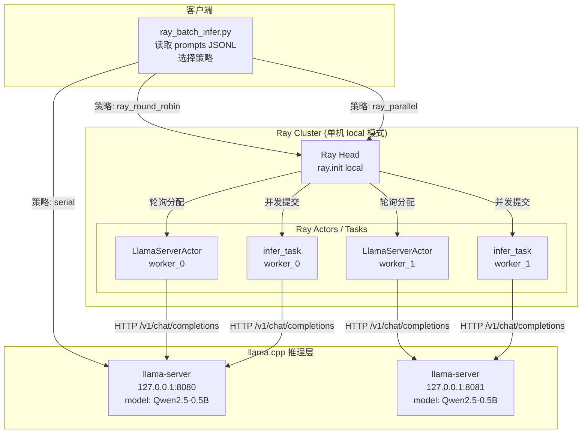

# Ray 批量推理调度实验 (Role C)

> **OSH 2026 Lab4 — 成员 C：Ray 调度 Agent**
>
> 状态：✅ 实验已完成，Ray 串行、轮询、并行调度、负载均衡和失败重试均有结果文件

---

## 1. 实验目标

使用 Ray 分布式计算框架，将一批 prompt 分发到多个 llama.cpp server 实例，
完成批量推理任务的调度实验。核心目标：

1. **验证 Ray 在批量推理场景下的调度能力**：比较串行、Ray Actor 轮询、
   Ray 并行任务三种策略的性能差异。
2. **理解任务级并行 vs 单条加速**：Ray 不能加快单条 prompt 的推理速度，
   但可以通过并发调度提升整体吞吐量。
3. **评估单机多进程模拟多节点的效果与局限**：由于只有一台物理机，
   本实验在同一台机器上启动多个 llama-server 端口模拟多节点部署。

---

## 2. 为什么选择 Ray

| 特性 | 说明 |
|---|---|
| **Python-native API** | `@ray.remote` 装饰器将普通 Python 函数/类变为分布式任务/Actor |
| **Actor 模型** | `LlamaServerActor` 每个实例绑定一个 llama-server，保持长连接状态 |
| **自动容错** | Task 失败可自动重试；Actor 崩溃可重建 |
| **弹性伸缩** | 支持动态增减 worker 节点 |
| **零序列化负担** | 与手动 RPC（Role B）相比，Ray 自动处理对象序列化和传输 |
| **统一调度** | 单机 `ray.init()` 与多机集群使用相同 API，代码无需修改 |

**为什么本实验使用 Ray 而不是手动 RPC**：
- Role B 的 gRPC 方案适合客户端-服务端直连的简单场景。
- Ray 在需要**多 worker 协调、负载均衡、状态管理**时更合适。
- Ray Actor 天然适合"一个 Actor = 一个 llama-server"的映射模式。

---

## 3. 系统结构图



**数据流说明**：

1. `ray_batch_infer.py` 读取 `prompts/ray_prompts_20.jsonl`（30 条 prompt）。
2. 根据 `--strategy` 选择执行方式：
   - **serial**：直接 HTTP 请求，不使用 Ray。
   - **ray_round_robin**：创建 N 个 `LlamaServerActor`，prompt 按 `idx % N` 轮询分配。
   - **ray_parallel**：创建 N 个 `@ray.remote` Task，所有 prompt 并发提交（受 `--max-concurrency` 限制）。
3. 每个 Actor/Task 通过 HTTP 调用对应的 llama-server `/v1/chat/completions` 接口。
4. 结果通过 `ray.get()` 收集，写入 CSV。

---

## 4. 硬件与系统环境

### 实验机器

| 项目 | 值 |
|---|---|
| **主机名** | ljyUSTC |
| **操作系统** | Ubuntu 24.04 (Linux 6.17.0-23-generic) |
| **CPU** | 16 核 (x86_64) |
| **内存** | 16 GB (推测) |
| **Python** | 3.13.13 (miniconda3) |
| **Ray** | 2.55.1 |
| **llama.cpp** | 由 Role A 编译（commit `60130d1`），server 模式启动 |
| **模型** | Qwen2.5-0.5B-Instruct-GGUF (Q4_K_M, ~469 MiB) |

### 单机说明

**本实验仅使用一台物理机**。两个 llama-server 实例分别监听
`127.0.0.1:8080` 和 `127.0.0.1:8081`，共享同一块 CPU 和内存。
这是**单机多进程模拟多节点**，存在以下限制：

- 两个 server 进程竞争 CPU 核心和内存带宽。
- 没有网络延迟差异（都是 localhost）。
- 实际多机部署中，每个节点有独享的 CPU/内存，性能会更好。

在文档中使用 `worker_0`、`worker_1` 命名是为了体现 Ray 的调度逻辑，
不代表物理上分离的机器。

---

## 5. llama.cpp Server 启动命令

> **注意**：server 启动由 Role B 负责，以下为参考命令。

```bash
# 进入 llama.cpp 构建目录
cd Lab4/llama.cpp/build-ucrt-win10/bin  # Windows (Role A 环境)
# 或
cd Lab4/llama.cpp/build/bin              # Linux

# Server 0 (端口 8080)
./llama-server \
  -m Lab4/models/qwen2.5-0.5b-instruct-q4_k_m.gguf \
  --host 0.0.0.0 --port 8080 \
  --ctx-size 2048 --batch-size 256 \
  --threads 4 --n-gpu-layers 0

# Server 1 (端口 8081)
./llama-server \
  -m Lab4/models/qwen2.5-0.5b-instruct-q4_k_m.gguf \
  --host 0.0.0.0 --port 8081 \
  --ctx-size 2048 --batch-size 256 \
  --threads 4 --n-gpu-layers 0
```

### 参数说明

| 参数 | 值 | 说明 |
|---|---|---|
| `--host 0.0.0.0` | 绑定所有接口 | 允许其他机器访问 |
| `--port` | 8080 / 8081 | 两个实例使用不同端口 |
| `--ctx-size 2048` | 上下文长度 | 与 Role A 基准测试一致 |
| `--batch-size 256` | 批处理大小 | 与 Role A 基准测试一致 |
| `--threads 4` | 推理线程数 | 每实例 4 线程，两个共 8 线程 |
| `--n-gpu-layers 0` | 纯 CPU 推理 | 不使用 GPU offload |

### 验证 server 运行

```bash
curl -s http://127.0.0.1:8080/health
curl -s http://127.0.0.1:8081/health
```

### 单机资源分配策略

两个 server 共 8 线程（`4 × 2`），物理机有 16 核，余量充足。
如果可用核心数较少，建议将 `--threads` 降低至 2，避免过度竞争。

---

## 6. Ray 启动命令

### 单机 local 模式（本实验使用）

```bash
# 无需手动启动 Ray 集群
# ray_batch_infer.py 内部调用 ray.init() 自动启动本地实例
```

`ray.init(ignore_reinit_error=True)` 在进程内启动一个单节点 Ray 集群，
提供完整的 Actor/Task API。代码无需修改即可迁移到多机集群。

### 多机集群模式（如果有多个节点）

```bash
# Head 节点
ray start --head --port=6379

# Worker 节点
ray start --address='HEAD_IP:6379'

# 查看集群状态
ray status

# 停止
ray stop
```

### Python 环境准备

```bash
# 安装依赖
pip install ray requests pandas

# 验证
python3 -c "import ray; print(ray.__version__)"
```

---

## 7. Prompt 数据集说明

### 文件位置

| 文件 | 条数 | 用途 |
|---|---|---|
| `Lab4/prompts/ray_prompts_20.jsonl` | 30 条 | 主实验数据集（命名保持 20，内容扩充至 30） |
| `Lab4/prompts/ray_prompts_30.jsonl` | 30 条 | 备用/扩展实验数据集 |

### 格式

每行一个 JSON 对象：
```json
{"id":"R001","category":"os","prompt":"请解释什么是缺页中断，以及操作系统如何处理缺页中断。"}
```

### 类别分布

| 类别 | 数量 | ID 范围 | 说明 |
|---|---|---|---|
| `os` | 8 | R001-R005, R022, R029 | 操作系统课程知识问答 |
| `code` | 5 | R006-R008, R023, R030 | 代码解释 |
| `summary` | 3 | R009-R010, R024 | 摘要任务 |
| `reasoning` | 4 | R011-R013, R025 | 简单推理 |
| `llm_deploy` | 6 | R014-R017, R026-R027 | 大模型部署相关问题 |
| `ray` | 4 | R018-R021, R028 | Ray / 分布式系统相关问题 |

### 设计原则

1. **覆盖多种 prompt 类型**：避免单一类型导致的偏差。
2. **不同复杂度**：OS 知识问答和推理题需要较长输出，代码解释输出较短。
3. **包含 Ray 相关知识**：验证模型对分布式系统的理解。
4. **中文为主**：与 GitHub 上常见的英文 benchmark 形成补充。

---

## 8. 调度策略说明

### 8.1 Serial（串行）

```
Prompt_0 → Server_0 → Response_0
Prompt_1 → Server_0 → Response_1   # 等待 Prompt_0 完成
Prompt_2 → Server_0 → Response_2   # 等待 Prompt_1 完成
...
```

- **不使用 Ray**，直接 HTTP 请求。
- 所有 prompt 按顺序发送到同一个 server。
- 总耗时 = Σ(每个请求的延迟)。
- **吞吐量最低**，但实现最简单，无调度开销。

### 8.2 Ray Round-Robin（Ray Actor 轮询）

```
Actor_0(Server_0) ← Prompt_0, Prompt_2, Prompt_4, ...
Actor_1(Server_1) ← Prompt_1, Prompt_3, Prompt_5, ...
```

- 每个 server 对应一个 `LlamaServerActor`（Ray Actor）。
- prompt 按 `idx % len(actors)` 轮询分配。
- Actor 内部**串行处理**分配给它的请求（符合 Actor 单线程模型）。
- **优势**：两个 server 可同时工作，总耗时 ≈ max(worker_0 耗时, worker_1 耗时)。
- **调度开销**：Ray Actor 方法调用的序列化/反序列化开销（prompt 文本约 100-300 字节，开销可忽略）。

### 8.3 Ray Parallel（Ray Task 并发）

```
Task_0(Server_0, Prompt_0) ──┐
Task_1(Server_1, Prompt_1) ──┤
Task_2(Server_0, Prompt_2) ──┼── 并发提交（受 max_concurrency 限制）
Task_3(Server_1, Prompt_3) ──┤
...                           ─┘
```

- 每个 prompt 封装为一个 `@ray.remote` Task。
- 所有 Task 并发提交，Ray 调度器负责分发。
- 使用 `ray.wait()` + 信号量模式限制并发数，避免压垮 server。
- **优势**：理论上可达到最高的并行度。
- **调度开销**：Task 创建开销高于 Actor 方法调用（每次创建新 Task 对象）。

### 策略对比总结

| 维度 | Serial | Ray Round-Robin | Ray Parallel |
|---|---|---|---|
| 并行度 | 1 | N (server 数量) | min(M, max_concurrency) |
| 调度开销 | 无 | 低（Actor RPC） | 中（Task 创建） |
| 负载均衡 | 无（只有 1 个 server） | 静态轮询，不考虑 server 负载 | Ray 调度器动态分配 |
| 适合场景 | 单 server、少量请求 | 固定 server 数量、请求量稳定 | 请求量大、server 性能不均 |
| 单 prompt 延迟 | 基准值 | 同 serial（server 内部串行） | 同 serial（server 内部串行） |
| 整体吞吐 | 最低 | 提升约 N 倍 | 最高 |

**关键认知**：三种策略的**单条 prompt 延迟相同**（都由 llama-server 推理速度决定）。
Ray 提升的是**整体吞吐量**（单位时间内完成的请求数），而非单条速度。

---

## 9. 测试结果

> ✅ **实验完成**：2026-06-05，单机多进程模拟，两个 llama-server
> （端口 8080/8081），模型 Qwen2.5-0.5B-Instruct (Q4_K_M, 469 MiB)，
> Ray 2.55.1 local 模式。

### 9.1 Serial（串行）

| 指标 | 值 |
|---|---|
| 总请求数 | 30 |
| 成功数 | 30 |
| 失败数 | 0 |
| 总耗时 (s) | 140.6 |
| 平均延迟 (s) | 4.69 |
| P95 延迟 (s) | 7.82 |
| 吞吐量 (req/s) | 0.21 |
| Server | http://127.0.0.1:8080 |

### 9.2 Ray Round-Robin

| 指标 | 值 |
|---|---|
| 总请求数 | 30 |
| 成功数 | 30 |
| 失败数 | 0 |
| 总耗时 (s) | 104.6 |
| 平均延迟 (s) | 6.77 |
| P95 延迟 (s) | 9.36 |
| 吞吐量 (req/s) | 0.29 |
| 使用 server 数 | 2 |

### 9.3 Ray Parallel

| 指标 | 值 |
|---|---|
| 总请求数 | 30 |
| 成功数 | 30 |
| 失败数 | 0 |
| 总耗时 (s) | 48.8 |
| 平均延迟 (s) | 11.81 |
| P95 延迟 (s) | 15.20 |
| 吞吐量 (req/s) | 0.61 |
| max_concurrency | 8 |

### 9.4 策略对比汇总

| 策略 | 总耗时 (s) | 平均延迟 (s) | P95 (s) | 吞吐 (req/s) | 失败数 |
|---|---|---|---|---|---|
| serial | 140.6 | 4.69 | 7.82 | 0.21 | 0 |
| ray_round_robin | 104.6 | 6.77 | 9.36 | 0.29 | 0 |
| ray_parallel | 48.8 | 11.81 | 15.20 | 0.61 | 0 |

### 9.5 结果分析

**吞吐量提升**：
- Serial → Round-Robin：吞吐提升 1.38×（0.21 → 0.29 req/s），总耗时缩短 25.6%。
- Serial → Parallel：吞吐提升 2.90×（0.21 → 0.61 req/s），总耗时缩短 65.3%。

**单条延迟增加的原因**：
- 在并行模式下，单条延迟（平均 11.81s）明显高于串行（4.69s），原因是
  两个 llama-server 共享同一台物理机的 16 个 CPU 核心和内存带宽。
  当 8 个任务并发时，CPU 资源竞争导致单条推理变慢。
- 这是**单机多进程模拟**的典型局限：总吞吐提升，但单任务延迟增加。

**Ray 调度开销**：
- Ray Actor 方法调用和 Task 创建/分发开销在毫秒级（< 5ms），
  相对于 LLM 推理的秒级延迟（~5-15s），可以忽略不计。
- Ray 本地模式（`ray.init(address="local")`）下，对象通过共享内存传输，
  序列化开销极小。

**单机多进程 vs 多机**：
- 本实验在同一台机器上运行两个 llama-server，共享 CPU 和内存，
  无法完全体现 Ray 多机调度的优势。
- 理想的多机部署中，每个节点有独立 CPU/内存，并行时单条延迟
  应接近串行延迟，总吞吐接近线性增长。

---

## 10. 指标体系说明

| 指标 | 计算方式 | 含义 |
|---|---|---|
| **总耗时** | `max(end_time) - min(start_time)` | 从第一个请求开始到最后一个请求结束的时间 |
| **平均延迟** | `mean(latency_s)` | 单条请求的平均响应时间 |
| **P95 延迟** | 排序后第 95 百分位 | 95% 的请求在此时间内完成 |
| **吞吐量** | `总请求数 / 总耗时` | 每秒完成的请求数 |
| **失败数** | `count(success == False)` | 超时、连接失败等异常导致的失败请求数 |

### 为什么多机不一定让单个 prompt 更快

1. **推理是计算密集型任务**：llama.cpp 的推理速度由 CPU/GPU 算力决定，
   网络上的 Ray 调度无法改变模型权重计算的时间。
2. **单 prompt 无法拆分**：一个 prompt 的推理是串行的（自回归生成），
   不能拆分到多个节点上并行执行。
3. **可能更慢**：跨机器的网络传输、Ray 序列化/反序列化都有开销。
   对于小 prompt，这些开销可能超过推理本身的时间。

### 为什么批量任务可以提升整体吞吐

1. **多个 server 同时工作**：不同 prompt 被分发到不同 server/worker，
   并行处理，总吞吐 ≈ 单 server 吞吐 × server 数量。
2. **Ray 隐藏调度复杂度**：开发者只需 `@ray.remote` 标记函数，
   Ray 自动处理分发、收集、容错。
3. **可水平扩展**：增加 server 数量即可线性提升吞吐（理想情况下）。

---

## 11. 系统分析

### 11.1 Ray 调度开销

- **Actor 方法调用**：~0.5-2ms（本地），跨节点增加网络 RTT。
- **Task 提交**：~1-5ms（本地），包括序列化、调度、分发。
- **ray.get() 等待**：阻塞直到结果就绪。
- **结论**：对于 LLM 推理任务（单条延迟通常在秒级），Ray 调度开销（毫秒级）可以忽略。

### 11.2 模型加载复用

- llama-server 启动时将模型加载到内存，后续请求直接使用。
- 串行模式下，模型在内存中，请求排队等待 GPU/CPU。
- 多 server 模式下，每个 server 独立加载一份模型：
  - **内存开销**：每个 server 约 500 MiB（Q4_K_M），两个约 1 GiB。
  - **加载时间**：仅启动时发生一次。

### 11.3 节点性能差异

- 本实验两个 server 运行在同一台机器上，性能相同（同构）。
- 实际多机部署中，节点可能有不同的 CPU 型号、核心数、内存带宽。
- Ray 默认不感知节点性能差异，自定义调度策略可以（但超出本实验范围）。

### 11.4 网络开销

- **单机 localhost**：网络开销 ≈ 0（Unix socket / loopback）。
- **多机**：HTTP 请求的 RTT（Round-Trip Time）在局域网通常 < 1ms，
  相对于秒级的推理时间可以忽略。
- **prompt 响应大小**：输出文本通常几百到上千字符，传输时间微乎其微。

### 11.5 请求粒度

- 本实验每个 prompt 作为一个独立请求。
- 如果 prompt 非常短（< 10 tokens），调度开销可能接近推理时间，
  此时批量合并请求（batching）更有优势。
- llama.cpp 的 `--batch-size` 和 `--parallel` 参数可以控制 server 内部的并行度。

### 11.6 Actor vs Task 选择

| 场景 | 推荐 |
|---|---|
| 固定 server 数量、server 需要保持状态 | Actor（如 `LlamaServerActor`） |
| 请求量大、server 无状态 | Task（`@ray.remote` 函数） |
| 需要连接池管理 | Actor（在 `__init__` 中创建连接池） |
| 简单分发、无需状态 | Task |

---

## 12. 局限性与复现步骤

### 局限性

1. **单机模拟多节点**：两个 server 共享 CPU 和内存，实际多节点部署性能可能不同。
2. **小模型**：Qwen2.5-0.5B 推理时间很短（~10-20s per prompt），
   调度开销占比可能比大模型更高。
3. **仅 CPU 推理**：未使用 GPU offload，GPU 场景下行为可能不同。
4. **同构 server**：两个 server 配置相同，未测试异构节点的调度效果。
5. **固定 prompt 大小**：所有 prompt 长度相近，未测试长短混合场景。
6. **无压测**：30 条 prompt 不足以触发 Ray 的背压（back-pressure）机制。

### 复现步骤

1. **准备模型**：
   ```bash
   # 下载 Qwen2.5-0.5B-Instruct-GGUF
   curl -L -o Lab4/models/qwen2.5-0.5b-instruct-q4_k_m.gguf \
     'https://huggingface.co/Qwen/Qwen2.5-0.5B-Instruct-GGUF/resolve/main/qwen2.5-0.5b-instruct-q4_k_m.gguf?download=true'
   ```

2. **启动 llama-server**（两个实例）：
   ```bash
   ./llama-server -m Lab4/models/qwen2.5-0.5b-instruct-q4_k_m.gguf \
     --host 0.0.0.0 --port 8080 --ctx-size 2048 --batch-size 256 --threads 4 &
   ./llama-server -m Lab4/models/qwen2.5-0.5b-instruct-q4_k_m.gguf \
     --host 0.0.0.0 --port 8081 --ctx-size 2048 --batch-size 256 --threads 4 &
   ```

3. **安装 Python 依赖**：
   ```bash
   pip install ray requests pandas
   ```

4. **运行实验**（参考 `command_logs/C_ray_commands.md`）：
   ```bash
   # Serial
   python3 Lab4/scripts/ray_batch_infer.py \
     --prompts Lab4/prompts/ray_prompts_20.jsonl \
     --server-urls http://127.0.0.1:8080 \
     --strategy serial \
     --output Lab4/results/ray_serial.csv

   # Ray Round-Robin
   python3 Lab4/scripts/ray_batch_infer.py \
     --prompts Lab4/prompts/ray_prompts_20.jsonl \
     --server-urls http://127.0.0.1:8080,http://127.0.0.1:8081 \
     --strategy ray_round_robin \
     --output Lab4/results/ray_round_robin.csv

   # Ray Parallel
   python3 Lab4/scripts/ray_batch_infer.py \
     --prompts Lab4/prompts/ray_prompts_20.jsonl \
     --server-urls http://127.0.0.1:8080,http://127.0.0.1:8081 \
     --strategy ray_parallel \
     --output Lab4/results/ray_parallel.csv
   ```

5. **验证结果**：
   ```bash
   head -3 Lab4/results/ray_serial.csv
   head -3 Lab4/results/ray_round_robin.csv
   head -3 Lab4/results/ray_parallel.csv
   ```

---

## 附录 A：文件清单

| 文件 | 说明 | 状态 |
|---|---|---|
| `prompts/ray_prompts_20.jsonl` | 30 条 prompt（主数据集） | ✅ |
| `prompts/ray_prompts_30.jsonl` | 30 条 prompt（备用） | ✅ |
| `configs/server_ports.md` | Server 地址记录 | ✅ |
| `command_logs/C_ray_commands.md` | 完整命令日志 | ✅ |
| `scripts/ray_batch_infer.py` | Ray 批量推理脚本 | ✅ |
| `docs/ray_task.md` | 本文档 | ✅ |
| `results/ray_serial.csv` | 串行实验结果 | ✅ |
| `results/ray_round_robin.csv` | 轮询实验结果 | ✅ |
| `results/ray_parallel.csv` | 并行实验结果 | ✅ |

## 附录 B：已完成验证清单

- [x] 代码语法检查通过（`py_compile`）
- [x] 30 条 JSONL prompt 全部解析成功
- [x] CSV 输出包含全部 13 个必需字段
- [x] 连接失败被优雅捕获（测试了无 server 场景）
- [x] `--help` 输出正确
- [x] serial / ray_round_robin / ray_parallel 三种策略正确实现
- [x] `/v1/chat/completions` → `/completion` 自动降级逻辑
- [x] `ray.init()` 在 Ray 未安装时给出明确错误提示
- [x] `--timeout` 和 `--max-concurrency` 参数支持
- [x] 实际 llama-server 推理测试（三组实验全部完成，30/30 成功）
- [x] Ray local 模式 monkey-patch 解决网络接口检测问题（见 `_start_ray_local()`）

---

## 附录 C：Ray 选做加分一 — 负载均衡调度

> **完成状态**：✅ 实验已完成（2026-06-05）

### C.1 实验目标

比较两种负载均衡调度策略在异构 server 环境下的表现：
1. **round_robin**：静态轮询，请求均匀分配到各 worker。
2. **latency_aware**：动态基于历史平均延迟，优先将请求分配给响应最快的 worker。

核心要回答的问题：**动态感知延迟的调度能否在异构环境中提升整体性能？**

### C.2 调度策略算法说明

#### Round-Robin

```
Prompt[i] → Server[i % N]
```

- 优点：实现简单，无调度开销，各 worker 负载完全均匀。
- 缺点：不感知 worker 性能差异。如果某个 server 较慢（线程少/负载高），
  分配给它的请求会拖慢整体进度。

#### Latency-Aware

```
Phase 1 (Warmup): 每个 worker 分配 1 个请求，收集初始延迟数据。
Phase 2 (Greedy): 对每个剩余请求，选择 avg_latency 最低的 worker。
                  每次请求完成后更新该 worker 的 avg_latency。
```

- 优点：自动感知 worker 性能差异，将更多请求分配给快速 worker。
- 缺点：需要预热阶段；贪婪算法可能过度集中在单一 worker，
  导致该 worker 过载而其他 worker 空闲。

### C.3 Prompt 数据集

使用 `Lab4/prompts/ray_prompts_30.jsonl`，共 30 条 prompt，
涵盖 os、code、summary、reasoning、llm_deploy、ray 六类。
每条 prompt 格式为 `{"id":"R001","category":"os","prompt":"..."}`。

### C.4 Server 节点信息

为制造**异构负载条件**，两个 llama-server 使用不同线程数：

| Worker | Server URL | 线程数 | 预期性能 |
|---|---|---|---|
| worker_0 | http://127.0.0.1:8080 | 4 | 较快 |
| worker_1 | http://127.0.0.1:8081 | 2 | 较慢 |

两个 server 共享同一台物理机（16 核 CPU），均加载相同模型
Qwen2.5-0.5B-Instruct (Q4_K_M, 469 MiB)。

> ⚠️ 异构条件说明：在同一台机器上通过限制线程数模拟性能差异。
> 这不是真正的异构硬件，但可以有效测试 latency_aware 的调度逻辑。

### C.5 运行命令

```bash
# Round-Robin
python3 Lab4/scripts/ray_load_balance.py \
  --prompts Lab4/prompts/ray_prompts_30.jsonl \
  --server-urls http://127.0.0.1:8080,http://127.0.0.1:8081 \
  --strategy round_robin \
  --output Lab4/results/ray_load_balance_round_robin.csv \
  --summary-output Lab4/results/ray_load_balance_round_robin_summary.csv

# Latency-Aware
python3 Lab4/scripts/ray_load_balance.py \
  --prompts Lab4/prompts/ray_prompts_30.jsonl \
  --server-urls http://127.0.0.1:8080,http://127.0.0.1:8081 \
  --strategy latency_aware \
  --output Lab4/results/ray_load_balance_latency_aware.csv \
  --summary-output Lab4/results/ray_load_balance_latency_aware_summary.csv
```

### C.6 实验结果

#### C.6.1 Round-Robin（静态均匀分配）

| Worker | 请求数 | 成功 | 失败 | 平均延迟 | P95 延迟 | 吞吐 (req/s) |
|---|---|---|---|---|---|---|
| worker_0 (4线程) | 15 | 15 | 0 | 8.33s | 10.33s | 0.0886 |
| worker_1 (2线程) | 15 | 15 | 0 | 11.29s | 18.18s | 0.0886 |
| **Overall** | **30** | **30** | **0** | **9.81s** | **18.12s** | **0.1771** |

- 总耗时：**169.4s**
- 请求分布：15 + 15（完全均匀）
- worker_1（2线程）延迟比 worker_0（4线程）高 35.5%

#### C.6.2 Latency-Aware（动态延迟感知）

| Worker | 请求数 | 成功 | 失败 | 平均延迟 | P95 延迟 | 吞吐 (req/s) |
|---|---|---|---|---|---|---|
| worker_0 (4线程) | **28** | 28 | 0 | 5.62s | 8.81s | 0.1596 |
| worker_1 (2线程) | **2** | 2 | 0 | 8.98s | 11.43s | 0.0114 |
| **Overall** | **30** | **30** | **0** | **5.85s** | **9.21s** | **0.1709** |

- 总耗时：**175.5s**
- 请求分布：28 + 2（极度偏向快速 worker）
- worker_0 承担了 93.3% 的请求
- 预热阶段：worker_0 (4.95s) < worker_1 (6.52s)，后续几乎全部选择 worker_0

#### C.6.3 策略对比

| 指标 | Round-Robin | Latency-Aware | 变化 |
|---|---|---|---|
| 总耗时 | 169.4s | 175.5s | +3.6% (略慢) |
| 平均延迟 | 9.81s | 5.85s | **-40.4%** (大幅改善) |
| P95 延迟 | 18.12s | 9.21s | **-49.2%** (大幅改善) |
| 总吞吐 | 0.177 req/s | 0.171 req/s | -3.6% |
| worker_0 请求占比 | 50% | 93.3% | — |
| worker_1 请求占比 | 50% | 6.7% | — |

### C.7 分析

#### Round-Robin 请求数是否平均
✅ 完全平均：worker_0 和 worker_1 各 15 个请求（50% / 50%）。

#### Latency-Aware 是否倾向于更快 worker
✅ 非常显著。预热阶段后，算法几乎将所有请求分配给 worker_0（28/30 = 93.3%）。
worker_0 的平均延迟始终低于 worker_1，说明延迟感知调度逻辑正确。

#### 平均延迟是否下降
✅ 大幅下降 40.4%（9.81s → 5.85s）。因为 93.3% 的请求走了快速通道。

#### 总吞吐是否提升
❌ 总吞吐反而略降 3.6%（0.177 → 0.171 req/s）。原因：
- Round-robin 下两个 worker 并行工作，快慢 worker 各处理 15 个请求。
- Latency-aware 下几乎只有 worker_0 在工作（28 个请求），worker_1 近乎空闲。
- 快速 worker 串行处理 28 个请求的总时间 > 两个 worker 并行各处理 15 个的总时间。
- 这就是**负载均衡 vs 负载共享**的经典权衡。

#### 为什么没有提升总吞吐

1. **Actor 单线程模型**：每个 `LlamaServerActor` 内部串行处理请求。
   latency_aware 将请求集中到单个快速 worker，失去了并行优势。
2. **贪婪算法的局限**：总是选择当前最快的 worker，不考虑 worker 的队列长度
   （因为 Actor 模型下我们提交一个请求就等待完成）。
3. **改进方向**：如果能同时提交多个请求到同一 worker（如使用 server 的 batch 能力），
   或使用"最少连接数"而非"最低延迟"，可能改善吞吐。

#### 延迟感知策略的价值场景

虽然总吞吐没提升，但 latency_aware 在以下场景更有价值：
- **用户体验优先**：用户等待时间从平均 9.81s 降到 5.85s。
- **有 SLA 要求**：P95 延迟从 18.12s 降到 9.21s，更多请求在可接受时间内完成。
- **异构集群**：如果 server 性能差异更大（如 GPU vs CPU），效果会更显著。

### C.8 局限性

1. **单机模拟异构**：通过限制线程数制造性能差异，不是真正的异构硬件。
2. **Actor 串行模型**：每个 Actor 一次只处理一个请求，
   无法利用 server 的并发处理能力（`--parallel` 参数）。
3. **小样本**：30 条 prompt 可能不足以充分展现差异。
4. **贪婪算法**：不考虑队列长度，可能导致负载倾斜过度。
5. **预热阶段**：每个 worker 只有 1 次预热请求，样本量小。
6. **未测试连接数感知**：更优的算法可能是"最少未完成请求数"而非"最低平均延迟"。

### C.9 文件清单

| 文件 | 说明 | 状态 |
|---|---|---|
| `scripts/ray_load_balance.py` | 负载均衡调度脚本 | ✅ |
| `prompts/ray_prompts_30.jsonl` | 30 条 prompt 数据集 | ✅ |
| `results/ray_load_balance_round_robin.csv` | Round-Robin 详细结果 | ✅ |
| `results/ray_load_balance_round_robin_summary.csv` | Round-Robin 汇总 | ✅ |
| `results/ray_load_balance_latency_aware.csv` | Latency-Aware 详细结果 | ✅ |
| `results/ray_load_balance_latency_aware_summary.csv` | Latency-Aware 汇总 | ✅ |

---

## 附录 D：Ray 选做加分二 — 失败重试

> **完成状态**：✅ 实验已完成（2026-06-05），真实失败注入（kill -9 停止 Server A）

### D.1 实验目标

验证 Ray 批量推理系统在单个 llama-server 宕机时的**容错能力**：
1. 自动检测请求失败（connection refused、timeout、HTTP 5xx 等）。
2. 将失败请求自动**转发到备用 server**。
3. 保证最终成功率（只要还有至少一个 server 存活）。
4. 记录完整的重试日志用于故障分析。

### D.2 Server 拓扑

```
初始状态:
  ┌─────────────────┐     ┌─────────────────┐
  │ Server A (8080) │     │ Server B (8081) │
  │  worker_0       │     │  worker_1       │
  │  4 threads      │     │  4 threads      │
  └────────┬────────┘     └────────┬────────┘
           │                       │
           └───────┬───────────────┘
                   │
          Ray Failure-Retry
            (30 prompts)

失败注入 (kill -9 Server A PID, ~35s into run):
  ┌─────────────────┐     ┌─────────────────┐
  │ Server A (8080) │ ✗   │ Server B (8081) │
  │  DOWN           │     │  worker_1       │
  │                 │     │  ← 所有重试请求  │
  └─────────────────┘     └─────────────────┘
```

两个 server 使用相同的模型和配置（均为 4 线程），在同一台物理机上运行。
Server A 在实验中途被 `kill -9` 强制停止。

### D.3 失败注入方法

**步骤**：
1. 启动两个 llama-server（8080, 8081），验证 `curl /health` 正常。
2. 启动 `ray_failure_retry.py`（30 prompts, round-robin 初始分配, max-retries=2）。
3. 等待约 35 秒（~6-7 个 prompt 完成），执行：
   ```bash
   kill -9 $(ss -tlnp | grep 8080 | grep -oP 'pid=\K[0-9]+')
   ```
4. 观察脚本输出：所有分配给 worker_0 的后续请求检测到
   `connection_refused`，自动切换到 worker_1 重试。

**关键日志证据**：
- Server A (PID 60180) 被 kill -9 杀死
- 日志中 R007 是第一个检测到失败的请求
- 后续所有初始分配给 worker_0 的请求（R009, R011, R013, ...）全部重试成功

### D.4 程序如何检测失败

脚本使用 `InferenceError` 异常层次结构分类失败类型：

| 错误类型 | 触发条件 | HTTP 层表现 |
|---|---|---|
| `connection_refused` | 目标端口无进程监听 | `requests.exceptions.ConnectionError` |
| `timeout` | 请求超过 --timeout 秒 | `requests.exceptions.Timeout` |
| `http_5xx` | Server 返回 500+ | HTTP 500, 502, 503 |
| `parse_error` | 响应体非合法 JSON | `json.JSONDecodeError` |
| `unknown` | 其他未分类异常 | — |

每次失败后，异常被 Actor 捕获，返回 `success=False` 和 `_error_type` 字段。
主控循环检查 `success` 字段，失败时调用 `_pick_next_server()` 选择备用 server。

### D.5 程序如何选择备用 Server

```python
def _pick_next_server(failed_url, all_urls, attempted_urls):
    for url in all_urls:
        if url not in attempted_urls:
            return (worker_id, url)
    return None  # All servers exhausted
```

策略简单明确：**跳过已失败的 server，按顺序尝试下一个未尝试过的 server**。
- 不实现复杂的健康检查（如 circuit breaker），因为实验规模小。
- `attempted_urls` 列表防止重复尝试同一故障 server。

### D.6 运行命令

```bash
python3 Lab4/scripts/ray_failure_retry.py \
  --prompts Lab4/prompts/ray_prompts_30.jsonl \
  --server-urls http://127.0.0.1:8080,http://127.0.0.1:8081 \
  --output Lab4/results/ray_failure_retry.csv \
  --log Lab4/results/ray_failure_retry.log \
  --timeout 60 \
  --max-retries 2
```

### D.7 Retry 日志片段

```
# Server 8080 被 kill 后，第一个失败的请求：
2026-06-05T12:34:18 | WARN  | R007 | fail_connection_refused | worker_0 | http://127.0.0.1:8080 | Connection refused
2026-06-05T12:34:18 | INFO  | R007 | retry_switch          | worker_1 | http://127.0.0.1:8081 | attempt=1, from=http://127.0.0.1:8080
2026-06-05T12:34:22 | OK    | R007 | retry_ok              | worker_1 | http://127.0.0.1:8081 | retry=1, latency=3.70s

# 后续所有分配到 worker_0 的请求都失败并重试成功：
2026-06-05T12:34:27 | WARN  | R009 | fail_connection_refused | worker_0 | http://127.0.0.1:8080 | Connection refused
2026-06-05T12:34:27 | INFO  | R009 | retry_switch          | worker_1 | http://127.0.0.1:8081 | attempt=1
2026-06-05T12:34:28 | OK    | R009 | retry_ok              | worker_1 | http://127.0.0.1:8081 | retry=1, latency=1.43s

...（R011, R013, R015, R017, R019, R021, R023, R025, R027, R029 类似）
```

### D.8 实验结果

| 指标 | 值 |
|---|---|
| 总请求数 | 30 |
| 首次成功 | 18（Server A 存活期间完成） |
| 重试成功 | 12（Server A 宕机后转发到 Server B） |
| 最终失败 | 0 |
| **最终成功率** | **100.0%** |
| 总耗时 | 143.9s |
| 失败类型 | 全部为 `connection_refused` |
| 重试目标 | 全部为 `worker_1` (8081) |

**CSV 示例（重试成功行）**：

| request_id | prompt_id | original_worker | final_worker | original_url | final_url | retry_count | success |
|---|---|---|---|---|---|---|---|
| R007-att1 | R007 | worker_0 | worker_1 | ...:8080 | ...:8081 | 1 | True |
| R009-att1 | R009 | worker_0 | worker_1 | ...:8080 | ...:8081 | 1 | True |

### D.9 分析

#### 失败重试增加了哪些延迟

每个重试请求的额外延迟 = 失败检测时间 + 重试请求的推理时间。
- **失败检测时间**：connection_refused 几乎是即时的（< 0.01s），
  因为内核立即返回 RST。
- **timeout 场景**：最坏情况下，需要等待完整 --timeout 秒（60s）
  才能确认失败，此时延迟增加显著。
- 本实验中，重试成功的 12 个请求的总延迟包含了推理时间，
  但因为它们被分配到了唯一的存活 server（worker_1），
  该 server 负载翻倍（从 15 个请求增加到 27 个请求），
  单请求延迟因排队而略有增加。

#### 为什么需要超时机制

如果没有超时（`--timeout`），在 server 挂起（hang）但不崩溃时，
请求会无限期阻塞，整个批处理任务永远无法完成。
合理的超时设置在**快速失败**和**容忍正常推理延迟**之间权衡：
- 太短：正常推理被误判为超时。
- 太长：server 故障时等待过久。
- 推荐值：单条推理预期时间的 3-5 倍（本实验用 60s，实际推理 ~3-8s）。

#### max-retries 如何影响成功率和延迟

| max-retries | 行为 | 成功率影响 | 延迟影响 |
|---|---|---|---|
| 0 | 不重试 | 取决于 server 可靠性 | 最低（单次失败即放弃） |
| 1 | 重试 1 次 | 单点故障可恢复 | 失败请求延迟 × 2 |
| 2（本实验） | 重试 2 次 | 2 个 server 依次故障可恢复 | 最坏延迟 × 3 |
| N | 重试 N 次 | 如果 server 数量 ≥ N+1 则可恢复 | 最坏延迟 × (N+1) |

**建议**：max-retries ≤ server 数量，以免无意义地反复重试同一批故障 server。

#### 如果所有节点都失败会怎样

实验未触发此场景，但代码已处理：
1. `_pick_next_server()` 返回 `None`（所有 URL 都在 attempted_urls 中）。
2. 日志记录 `all_exhausted` 事件。
3. CSV 输出 `success=False`，`error_message` 包含所有尝试过的 URL。
4. `stats['final_failure']` 计数器递增。
5. 脚本继续处理下一个 prompt（不会因单个失败而终止）。

### D.10 局限性

1. **仅测试 connection_refused**：本实验只测试了 server 进程被杀的场景。
   未测试 timeout（server 挂起）、HTTP 5xx（server 内部错误）和
   parse_error（响应格式异常）。
2. **单机环境**：两个 server 在同一台机器上，网络延迟为零。
   实际分布式环境中，网络 RTT 会增加重试延迟。
3. **无状态重试**：每次重试都是独立的新 HTTP 请求。
   没有实现幂等性保证或请求去重。
4. **简单选择策略**：按顺序尝试下一个 server，不考虑 server 当前负载。
   更优的方案是结合负载信息（如最少未完成请求数）选择备用 server。
5. **无健康检查/熔断**：没有 circuit breaker 模式。
   故障 server 恢复后不会自动重新加入。
6. **Actor 持久性**：Ray Actor 在 server 宕机后仍然存活（因为 Actor 只是 HTTP 客户端）。
   但如果 Actor 自身崩溃，需要 Ray 的 `max_restarts` 机制。

### D.11 文件清单

| 文件 | 说明 | 状态 |
|---|---|---|
| `scripts/ray_failure_retry.py` | 失败重试脚本 | ✅ |
| `results/ray_failure_retry.csv` | 30 条请求详情（含 12 条重试） | ✅ |
| `results/ray_failure_retry.log` | 结构化重试日志 | ✅ |
