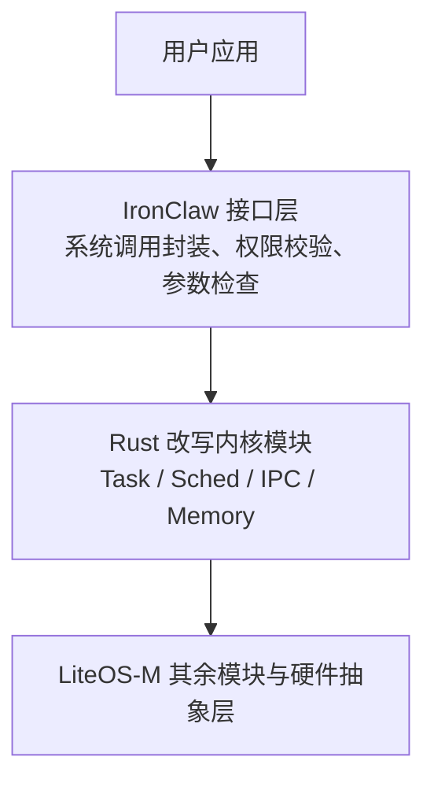

# Vexilon

## Logo

## 目录

- [Vexilon](#vexilon)
  - [Logo](#logo)
  - [目录](#目录)
  - [团队信息](#团队信息)
    - [队长](#队长)
    - [队员](#队员)
  - [课程信息](#课程信息)
  - [项目进度（持续更新）](#项目进度持续更新)
  - [项目概览](#项目概览)
  - [项目背景与立项动机](#项目背景与立项动机)
  - [问题定义：原版 C-LiteOS-M 的核心痛点](#问题定义原版-c-liteos-m-的核心痛点)
  - [总体目标与核心产出](#总体目标与核心产出)
    - [总体目标](#总体目标)
    - [核心产出](#核心产出)
  - [技术路线与系统架构](#技术路线与系统架构)
    - [技术栈](#技术栈)
    - [架构思路（简化）](#架构思路简化)
    - [典型接口方向（暂定）](#典型接口方向暂定)
  - [模块改写范围与优先级](#模块改写范围与优先级)
    - [已有基础](#已有基础)
    - [本项目待推进模块](#本项目待推进模块)
      - [优先级 ★★★（核心路径，最高价值）](#优先级-核心路径最高价值)
      - [优先级 ★★（IPC 通信子系统，独立性强）](#优先级-ipc-通信子系统独立性强)
      - [优先级 ★（后续收尾与系统集成）](#优先级-后续收尾与系统集成)
  - [阶段计划](#阶段计划)
    - [阶段 1：基础验证阶段](#阶段-1基础验证阶段)
    - [阶段 2：核心能力阶段](#阶段-2核心能力阶段)
    - [阶段 3：通信能力阶段](#阶段-3通信能力阶段)
    - [阶段 4：系统整合阶段](#阶段-4系统整合阶段)
  - [测试与验证方案](#测试与验证方案)
  - [预期创新点与价值](#预期创新点与价值)
  - [风险评估与应对策略](#风险评估与应对策略)
  - [仓库结构建议](#仓库结构建议)
  - [相关文档](#相关文档)
  - [参考链接](#参考链接)

## 团队信息

### 队长
* PB24000189 付锦鹏

### 队员
* PB24000323 杨邵恺
* PB24111686 陈安达
* PB24111702 邱义家
* PB24111700 李俊谕

## 课程信息
* 课程：OSH-2026 操作系统课程设计
* 学期：2026 春季学期
* 单位：中国科学技术大学
* 
## 项目进度（持续更新）

| 项目阶段 | 日期 | 项目进展 |
|:---:|:---:|---|
| 选题探索 | 3.4 ~ 3.15 | 组内成员线下开展研讨会分析往年小组选题，提出1.增强型LLm嵌入文件系统、2.Rust改写系统内核、3.网络协议栈改写等多种选择 |
|   | 3.16 ~ 3.18 | 组内成员锁定Rust重写项目并对重写哪种具体系统开展探索 |
| 项目调研 | 3.19 ~ 3.29 | 通过比较多种选择，并于老师和助教进行激烈的线上讨论后，最终选定LiteOS-M |
| 路线收敛 | 3.30 ~ 4.1  | 与老师进行线下研讨，确定“LiteOs-M核心模块接力重构 + IronClaw 接口层”最终路线 |
| 报告撰写 | 4.6 ~ 4.19 | 开展项目仓库主页README、调研报告、可行性报告、项目介绍ppt的写作任务并在过程中不断修正错误、加深对任务理解 |
| 待更新 | 4.19 ~ ··· |   |

## 项目概览

Vexilon 是中国科学技术大学 2026 春季学期 OSH-2026 课程项目小组。项目聚焦于：

1. 在 LiteOS-M 现有 C 语言内核和往年小组改写的基础上，继续进行 Rust 深入式重构；
2. 在内核与用户层之间引入 IronClaw 中间层，构建安全、可扩展的双向调用接口；

## 项目背景与立项动机

随着 IoT 设备从“能运行”转向“可长期安全运行”，传统 C 语言内核在内存安全与并发安全方面的系统性风险逐渐放大：

1. 裸指针与手动内存管理容易引发 UAF、越界写、空指针解引用、双重释放等问题；
2. 并发安全依赖人工规范，在多任务/多核场景下易出现竞态条件；
3. 资源受限设备上难以依赖重型运行时检测手段进行兜底。

Rust 在 no_std 场景的成熟度提高，以及操作系统领域（Linux、Android 等）对 Rust 的持续引入，使得“对高风险模块优先 Rust 化”成为现实可行路线。

在此基础上，本项目进一步探索 IronClaw 的能力边界：通过安全接口桥接用户层与内核层，支持后续 AI 驱动的系统实验自动化与策略评估。

## 问题定义：原版 C-LiteOS-M 的核心痛点

本项目重点关注以下三类问题：

1. 内存安全问题：内核堆管理、任务控制块、链表/队列等路径存在潜在越界与悬挂指针风险；
2. 并发安全问题：锁使用正确性依赖人工经验，难以在编译期发现竞争访问错误；
3. 调用安全与隔离问题：用户层到内核层接口缺乏统一能力边界与强类型约束。

## 总体目标与核心产出

### 总体目标

1. 在保证 LiteOS-M 轻量与实时性特征的前提下，提升内核关键路径的内存安全与并发安全；
2. 完成可运行的核心功能链路：任务管理 + 调度 + 至少 1 个 IPC 场景；
3. 建立用户层到内核层、内核层到用户层的统一接口原型。

### 核心产出

1. Rust 改写后的 LiteOS-M 核心模块代码（分阶段提交）；
2. IronClaw-LiteOS-M 接口层设计与原型实现（含双向调用接口）；
3. 实验与验证报告：功能正确性、性能影响、安全性收益；
4. 文档化迁移方法：模块优先级、接口策略、测试流程、风险清单。

## 技术路线与系统架构

### 技术栈

1. 语言与运行环境：Rust（no_std + alloc）+ C（混合内核）；
2. 交叉编译与构建：cargo + LiteOS-M 原有构建链路；
3. 交互与绑定：FFI/bindgen、repr(C) 数据结构对齐；
4. 验证环境：单元测试 + QEMU 仿真 + 开发板真机测试。

### 架构思路（简化）

### 典型接口方向（暂定）

1. 用户层 -> 内核层：任务管理、调度控制、IPC、内存管理接口；
2. 内核层 -> 用户层：事件通知、回调注册与触发。

## 模块改写范围与优先级

### 已有基础

1. 2024 届成果已完成 mm/los_memory.c 的 Rust 改写（动态内存管理）。

### 本项目待推进模块

详情见[调研报告](./docs/research_report.md)，待改写模块按优先级分为三类：

#### 优先级 ★★★（核心路径，最高价值）

#### 优先级 ★★（IPC 通信子系统，独立性强）

#### 优先级 ★（后续收尾与系统集成）

详细的改写原因、难点分析与适配性说明见[调研报告](./docs/research_report.md)与[可行性报告](./docs/feasibility_report.md)。

## 阶段计划

### 阶段 1：基础验证阶段

1. 完成 los_sortlink.c 改写；
2. 跑通 FFI 与模块级测试闭环；
3. 沉淀统一编码模板与接口命名规范。

### 阶段 2：核心能力阶段

1. 联合改写 los_task.c + los_sched.c；
2. 打通任务创建、阻塞/唤醒、优先级调度链路；
3. 建立关键路径性能基线。

### 阶段 3：通信能力阶段

1. 选择 1~2 个 IPC 模块完成改写与联调；
2. 验证任务间通信与同步语义正确性。

### 阶段 4：系统整合阶段

1. 对接 Tick/定时器/初始化流程；
2. 完成 IronClaw 双向接口原型；
3. 形成完整报告与演示材料。

## 测试与验证方案

1. 单元测试：验证模块内部数据结构与边界行为；
2. FFI 交互测试：验证 C/Rust 参数传递与 ABI 一致性；
3. QEMU 仿真：验证任务调度、IPC、定时器等核心场景；
4. 真机测试：验证实时性指标、稳定性与资源占用；
5. 安全回归：重点检查空指针、越界、竞争访问路径。

## 预期创新点与价值

1. 渐进式 Rust 化路线：从可独立模块切入，降低重构风险；
2. 类型安全内核原语：提升关键路径可审计性与可靠性；
3. IronClaw 统一交互层：探索 AI Agent 与 RTOS 的安全融合方式；
4. 工程方法论沉淀：为后续课程/社区项目提供可复用模板。

## 风险评估与应对策略

1. no_std 适配复杂：优先建立最小可运行模板，逐步扩展能力；
2. C/Rust 混合编译复杂：以小模块先行验证链接链路；
3. 实时性回退风险：引入阶段性基准测试与回归阈值；
4. 模块耦合导致联调困难：采用“接口先对齐、功能后替换”策略。

## 仓库结构建议

以下为建议的后续目录组织方式，便于代码与文档协同维护：

1. docs/：调研报告、可行性报告、阶段总结、实验记录；
2. src/ 或 rust_kernel/：Rust 改写模块代码；
3. bridge/：IronClaw-LiteOS-M 接口层与绑定代码；
4. tests/：单元测试、集成测试、仿真脚本；
5. tools/：构建与分析脚本。

## 相关文档

1. [调研报告](https://github.com/OSH-2026/Vexilon/blob/main/docs/research_report.md)
2. [可行性报告](https://github.com/OSH-2026/Vexilon/blob/main/docs/feasibility_report.md)

## 参考链接

1. LiteOS-M（Gitee）：https://gitee.com/openharmony/kernel_liteos_m
2. IronClaw（GitHub）：https://github.com/nearai/ironclaw
3. Tock OS（GitHub）：https://github.com/tock/tock
4. Hubris（GitHub）：https://github.com/oxidecomputer/hubris
5. Microsoft: We need a safer systems programming language:
	https://www.microsoft.com/en-us/msrc/blog/2019/07/we-need-a-safer-systems-programming-language
6. NSA: Software Memory Safety:
	https://media.defense.gov/2022/Nov/10/2003112742/-1/-1/0/CSI_SOFTWARE_MEMORY_SAFETY.PDF